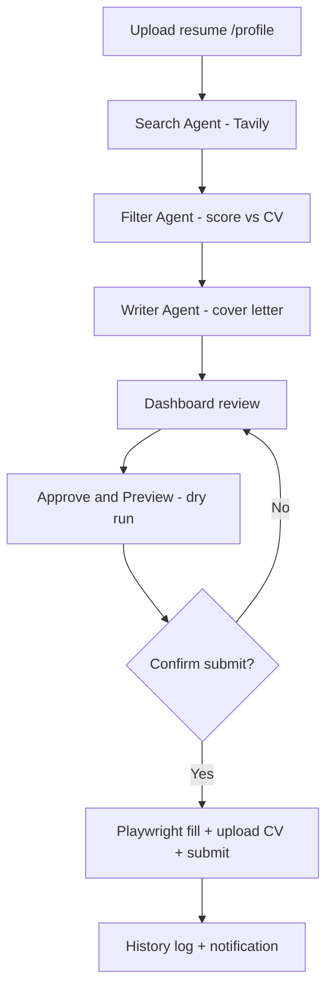

# ApplAI

An open-source AI agent that searches for jobs and scholarships, scores them against your resume, drafts application materials, and can auto-fill application forms via Playwright — with your approval.

[](LICENSE)
[](https://github.com/YOUR_USERNAME/applai/actions/workflows/ci.yml)

> **Before publishing:** replace `YOUR_USERNAME` in this file and `package.json` with your GitHub username.

## Features

- **Resume-driven search** — upload a CV; Tavily queries are built from your skills, role, and experience
- **ATS-focused crawling** — targets Greenhouse, Lever, Ashby, Remotive, and similar apply URLs
- **AI scoring** — hybrid rule-based + Ollama matching against your profile
- **Draft generation** — cover letters and scholarship essays via local Ollama
- **Dashboard** — review, approve, reject, clear crawled results, rescore
- **Safe apply flow** — approve previews form fill first; submit only after explicit confirmation
- **Application history** — audit log of every preview and submission attempt
- **Health dashboard** — check Ollama, Supabase, Tavily, and Playwright at `/status`
- **Docker Compose** — one-command API + dashboard setup
- **Notifications** — optional email digest and Twilio WhatsApp alerts
- **Scheduled pipeline** — daily search at 6:00 AM, digest at 8:00 AM

## Screenshots

<!-- Add PNGs to docs/screenshots/ then uncomment:

-->

## Architecture



## Tech stack

| Layer | Technology |
|-------|------------|
| Runtime | Node.js, TypeScript |
| LLM | [Ollama](https://ollama.com) (local or cloud models) |
| Search | [Tavily](https://tavily.com) |
| Database | [Supabase](https://supabase.com) (PostgreSQL) |
| API | Express |
| Dashboard | Next.js |
| Browser automation | Playwright |
| Notifications | Nodemailer, Twilio (optional) |

## Quick start

### Prerequisites

- Node.js 20+
- [Ollama](https://ollama.com) (`ollama serve`)
- [Tavily](https://tavily.com) API key
- [Supabase](https://supabase.com) project

### Install

```bash
git clone https://github.com/YOUR_USERNAME/applai.git
cd applai
npm install
npx playwright install chromium

cd dashboard && npm install && cd ..
cp .env.example .env
cp dashboard/.env.local.example dashboard/.env.local
```

Fill in `.env` and `dashboard/.env.local`. See [Environment variables](#environment-variables) and [API keys setup](#api-keys-setup).

### Database

See [supabase/README.md](supabase/README.md).

**Fresh install:** run `schema.sql` then `profile.sql`, create Storage buckets `resumes` and `screenshots`.

### Run

```bash
# Terminal 1 — API (port 4000)
npm run dev

# Terminal 2 — Dashboard (port 4001)
npm run dev:dashboard
```

1. Open [http://localhost:4001/status](http://localhost:4001/status) — all services should be green
2. Upload your resume at [http://localhost:4001/profile](http://localhost:4001/profile)
3. Click **Run Search** on the home page
4. **Approve & Preview** an opportunity (fills form, does not submit)
5. Review screenshot + form fill report → **Confirm & Submit**

### Docker

```bash
cp .env.example .env   # fill in keys
docker compose up --build
```

- API: [http://localhost:4000](http://localhost:4000)
- Dashboard: [http://localhost:4001](http://localhost:4001)

Ollama must run on the host (`ollama serve`). The API container uses `host.docker.internal:11434`.

## API keys setup

### Ollama

```bash
ollama serve
ollama pull llama3.2          # or any model you have
ollama list                   # optional: set OLLAMA_MODEL in .env
```

Cloud models (e.g. `minimax-m2.5:cloud`) work if listed in `ollama list`.

### Tavily

1. Sign up at [tavily.com](https://tavily.com)
2. Copy API key (starts with `tvly-`)
3. Set `TAVILY_API_KEY` in `.env` and restart the API

### Supabase

1. Create a project at [supabase.com](https://supabase.com)
2. Run SQL from [supabase/](supabase/README.md)
3. **Settings → API** → copy Project URL, `anon` key, and `service_role` key
4. Set `SUPABASE_URL`, `SUPABASE_ANON_KEY`, `SUPABASE_SERVICE_ROLE_KEY` in `.env`

Use the **service role** key only on the backend API — never in the dashboard frontend.

### Gmail notifications (optional)

1. Enable 2FA on your Google account
2. Create an [App Password](https://myaccount.google.com/apppasswords)
3. Set `EMAIL_USER`, `EMAIL_PASS`, `NOTIFICATION_EMAIL` in `.env`

### Twilio WhatsApp (optional)

1. [Twilio Console](https://www.twilio.com/console) → Account SID + Auth Token
2. Enable [WhatsApp Sandbox](https://www.twilio.com/docs/whatsapp/sandbox) or a registered sender
3. Set `TWILIO_ACCOUNT_SID`, `TWILIO_AUTH_TOKEN`, `TWILIO_WHATSAPP_FROM`, `WHATSAPP_TO`

## Environment variables

| Variable | Required | Description |
|----------|----------|-------------|
| `TAVILY_API_KEY` | Yes | Tavily search API key |
| `SUPABASE_URL` | Yes | Supabase project URL |
| `SUPABASE_SERVICE_ROLE_KEY` | Yes | Backend key (bypasses RLS) |
| `SUPABASE_ANON_KEY` | Yes | Public anon key |
| `OLLAMA_BASE_URL` | No | Default `http://localhost:11434` |
| `OLLAMA_MODEL` | No | Auto-detected from `ollama list` if unset |
| `EMAIL_USER` / `EMAIL_PASS` / `NOTIFICATION_EMAIL` | No | Gmail digest |
| `TWILIO_*` / `WHATSAPP_TO` | No | WhatsApp digest |
| `PLAYWRIGHT_HEADLESS` | No | Unset or `true` = headless; `false` = visible browser |
| `PORT` | No | API port (default `4000`) |
| `DASHBOARD_URL` | No | CORS origin (default `http://localhost:4001`) |

Dashboard: `NEXT_PUBLIC_API_URL=http://localhost:4000` in `dashboard/.env.local`.

## API endpoints

| Method | Endpoint | Description |
|--------|----------|-------------|
| `GET` | `/health` | Service health (`?deep=true` runs live Tavily + Playwright checks) |
| `GET` | `/api/opportunities` | List (`status`, `type`, `minScore` filters) |
| `GET` | `/api/opportunities/:id` | Detail + application draft |
| `POST` | `/api/opportunities/:id/approve` | Approve + preview form (dry-run) |
| `POST` | `/api/opportunities/:id/approve` `{ "apply": true }` | Approve + submit immediately |
| `POST` | `/api/opportunities/:id/reject` | Reject |
| `POST` | `/api/opportunities/clear` | Clear crawled results |
| `POST` | `/api/opportunities/rescore` | Re-run match scoring |
| `POST` | `/api/submit/:id` | Preview form fill |
| `POST` | `/api/submit/:id` `{ "confirmSubmit": true }` | Confirm and submit |
| `GET` | `/api/history` | Submission audit log |
| `GET` | `/api/profile` | Active profile |
| `POST` | `/api/profile/resume` | Upload resume (multipart) |
| `POST` | `/api/run-search` | Run search pipeline |
| `GET` | `/api/pipeline/status` | Pipeline state |
| `GET` | `/api/pipeline/stream` | Live pipeline logs (SSE) |

## Scheduler

| Time | Job |
|------|-----|
| 6:00 AM daily | Search → filter → write pipeline |
| 8:00 AM daily | Email + WhatsApp digest of shortlisted opportunities |

## Project structure

```
applai/
├── prompts/              # LLM prompt templates
├── src/
│   ├── agents/           # search, filter, writer, submission
│   ├── api/                # Express routes
│   ├── config/             # env, sources, profile defaults
│   ├── services/           # supabase, ollama, health, submission log
│   └── utils/              # form fill, match scoring, URL filters
├── dashboard/              # Next.js UI (/, /profile, /history, /status)
├── supabase/               # SQL schema + setup guide
├── docker-compose.yml
└── .github/workflows/      # CI
```

## Customizing your profile

Upload a resume at **/profile**. Skills, experience, and education are extracted automatically and drive search, scoring, and cover letters.

Static fallbacks in `src/config/profile.ts` apply only before a resume is uploaded.

## Auto-apply limitations

- Works best on **direct application URLs** (Greenhouse, Lever, Ashby, etc.)
- Login walls, CAPTCHA, and custom ATS questions may block automation
- Always review the submission screenshot before confirming
- You are responsible for applications submitted through this tool

## Troubleshooting

| Symptom | Fix |
|---------|-----|
| `Could not find table 'submission_logs'` | Run `supabase/submission_logs.sql` in Supabase SQL Editor ([guide](supabase/README.md)) |
| `new row violates row-level security` (42501) | Add `SUPABASE_SERVICE_ROLE_KEY` to `.env` and restart API; or run `supabase/rls.sql` |
| `TAVILY_API_KEY is not set` | Add key to `.env`, restart `npm run dev` |
| `browserType.launch: Executable doesn't exist` | Run `npx playwright install chromium` |
| Dashboard empty but API has data | Clear score filter (use "Any score"); click **Rescore all** |
| Search finds nothing | Upload resume at `/profile` first — search uses only CV data |
| Match scores all 0 | Click **Rescore all**; scores use skill overlap + Ollama |
| Form fill: all fields missed | URL may be a listing page, not an apply form — use Greenhouse/Lever links |
| Resume upload works but apply misses CV | Create `resumes` bucket in Supabase Storage; re-upload CV |
| History page empty | Normal until first **Approve & Preview**; ensure `submission_logs` table exists |
| Ollama JSON parse errors | Model may struggle with JSON — app falls back to rule-based scoring/search |

Check **Status** page at [http://localhost:4001/status](http://localhost:4001/status) or `GET /health?deep=true`.

## Publishing checklist

- [ ] Replace `YOUR_USERNAME` in README and `package.json`
- [ ] `.env` and `dashboard/.env` not committed (see `.gitignore`)
- [ ] Rotate keys if they were ever shared
- [ ] Add screenshots to `docs/screenshots/` (optional but recommended)

```bash
git init
git add .
git status   # verify .env is not listed
git commit -m "Initial open-source release"
git remote add origin https://github.com/YOUR_USERNAME/applai.git
git push -u origin main
```

## Contributing

See [CONTRIBUTING.md](CONTRIBUTING.md). Bug reports and feature requests welcome via GitHub Issues.

## License

[MIT](LICENSE) — Copyright (c) 2026 ApplAI contributors
