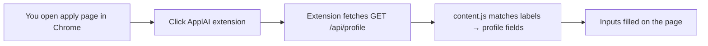

# ApplAI Chrome Extension

Fills job application forms on **sites where you're already logged in** (LinkedIn, company portals, etc.) using your ApplAI profile from the local API.

Playwright auto-apply runs in the backend; this extension runs **in your browser session** so it can reach pages that need your login cookies.

## How it works

1. ApplAI API running (`npm run dev` on port 4000)
2. Resume uploaded at `/profile`
3. Load extension in Chrome
4. Open a job application page
5. Click extension → **Fill this page**

## Install (developer mode)

1. Open `chrome://extensions`
2. Enable **Developer mode**
3. **Load unpacked** → select the `extension/` folder in this repo
4. In extension popup, set API URL (`http://localhost:4000`) and API secret if you use `API_SECRET`

## Limits

- Fills common fields (name, email, phone, location) by label heuristics
- Does not upload CV files automatically (browser security)
- Does not submit the form — review before clicking Apply
- For full AI suggestions + cover letter, use dashboard **Scan form** or **Approve & Preview**

## API auth

If `API_SECRET` is set in `.env`, enter the same value in the extension popup.
